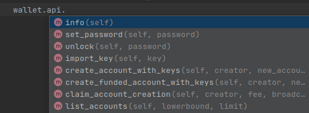

## How to start

The easiest way of working with TestTools is to install them. Then package will know which executables (_hived_, _cli_wallet_, etc.) should use and your IDE will support code completion. It is recommended if you are a tester. But if you don't want to install anything, jump to **Run without installation** below. It might be better option if you want to run selected test only once.

#### Installation

Run installation script. It will install TestTools and help you to select which _hived_, _cli_wallet_ and such executables should be used by TestTools.
```bash
python3 hive/tests/test_tools/install.py
```

#### Running without installation

Run tests in current directory:
```bash
PYTHONPATH="${PYTHONPATH}:/home/dev/hive/tests/test_tools/package" HIVE_BUILD_ROOT_PATH="/home/dev/hive/build" pytest
```

Run selected script:
```bash
PYTHONPATH="${PYTHONPATH}:/home/dev/hive/tests/test_tools/package" HIVE_BUILD_ROOT_PATH="/home/dev/hive/build" python3 your_script.py
```

## Features

### Easy testnet creation
You can run testnet with node configured for blocks production and attached wallet with such simple script:
```python
from test_tools import World

if __name__ == '__main__':
    with World() as world:
        node = world.create_init_node()
        node.run()

        wallet = node.attach_wallet()
```

### Node and wallet APIs
Node and wallet has `api` member which allows for communication with them. You can communicate with node and wallet with following syntax:
```python
# Example node calls
node.api.condenser.get_key_references(['TST5P8syqoj7itoDjbtDvCMCb5W3BNJtUjws9v7TDNZKqBLmp3pQW'])
node.api.database.list_witnesses(start=None, limit=100, order='by_name')

# Example wallet calls
wallet.api.create_account('initminer', 'john', '{}')
wallet.api.get_account('john')
```

Use your IDE's code completion to get hints for wallet api calls like below. IDE should help you to write method names, but also parameters.



### Node configuration
Node has `config` member which allow for editing _hived_ _config.ini_ file. You can configure node in following way:
```python
node.config.enable_stale_production = True
node.config.required_participation = 0
node.config.plugin.extend(['p2p', 'witness'])
```

> :warning: Type support is not completed yet. Not all config entries types are set correctly. At the moment most of them are treated as strings. So you have to write like:
> ```python
> # Note that all are strings
> node.config.market_history_bucket_size = '[15,60,300,3600,86400]'
> node.config.webserver_thread_pool_size = '32'
> node.config.witness_skip_enforce_bandwidth = '1'
> ```

Provides support for Python types. You can write:
```python
if node.config.enable_stale_production and node.config.required_participation < 20:
    ...
```
because type of `node.config.enable_stale_production` is `bool` and type of `node.config.required_participation` is `int`.

### Select which executables should library use
You can select them in python script, via command line arguments, environment variables or by executables installation ([read more](documentation/paths_to_executables.md)).

### Generate public and private keys
Some tests requires multiple accounts creation. To perform operations on them keys are required. TestTools provides support for key generation with `Account` class. You only need to provide account name. Generated account contains member variables `private_key` and `public_key`, which can be used in tests. Optionally you can specify `secret` parameter, which affects generated keys.
```python
# Simple account creation example
account = Account('John')
print(account.private_key)  # Prints: 5KSJQHSBh4vxZVaY2fi3vbhDbkkg7C74pE4S3bigEQyct2RqMDf
print(account.public_key)   # Prints: TST8FukVPod6riKr2mg94hhDanCzCYvivJtPdpcUVnEChaJ5N9QbC

# Inline usage example
print(Account('initminer').private_key)  # Prints: 5JNHfZYKGaomSFvd4NUdQ9qMcEAC43kujbfjueTHpVapX1Kzq2n
```

### Send multiple operations in single wallet transaction
TestTools provides support for sending single transaction containing multiple operations. It is helpful for optimizing scripts which send multiple transactions and wait 3 seconds for every transaction confirmation. When sending these operations in one transaction, you wait for only one confirmation, so your script executes much faster. You can do it with following syntax:
```python
with wallet.in_single_transaction():
    wallet.api.create_account('initminer', account, '{}')
    wallet.api.transfer('initminer', account, amount, 'memo')
```
In above example operations `create_account` and `transfer` are sent in single transaction during exiting from "with" statement.

Implementation is very flexible and allows for using python control statements (ifs, loops), functions which sends wallet api calls and so on. See example below showing for-loop use case during transaction preparation.
```python
accounts_and_balances = {
    'first': '100.000 TESTS',
    'second': '200.000 TESTS',
    'third': '300.000 TESTS',
}

with wallet.in_single_transaction():
    for account, amount in accounts_and_balances.items():
        wallet.api.create_account('initminer', account, '{}')
        wallet.api.transfer('initminer', account, amount, 'memo')
```

### Features waiting for description
- Logger
- Network
- MainNet
